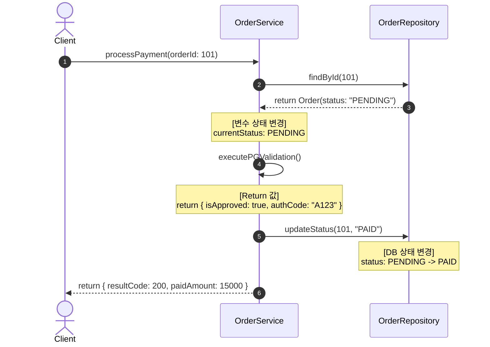

# Data Flow & Logic Change Impact Analysis Skill

현재 브랜치, git diff 기준으로 로직, 함수, 또는 모듈을 대상으로 **As-Is vs To-Be 데이터 흐름, 변수 상태(State)의 격차, 함수의 Return 값 변화**를 역추적하고 종합 영향도 보고서를 작성합니다.

## 분석 가이드라인

1. **상태(State) & 리턴값 정밀 추적**:
    - 데이터 흐름 분석 시 반드시 **변수의 값 변화(예: status: PENDING -> SUCCESS)**와 **함수/메서드의 Return 값(예: return { isSuccess: true })**을 단계별로 명확히 표기합니다.
    - DB 트랜잭션(C/R/U/D) 시점과 비동기 이벤트 발생 시점을 식별하여 명시합니다.

2. **Mermaid 시각화 mandatory 규칙**:
    - 다이어그램에는 단순히 호출 관계만 적지 않고, **메서드 인자/리턴값**과 **변수의 주요 상태 변화**가 메시지 흐름 및 Note 블록에 직관적으로 드러나도록 작성합니다.

3. **산출물 경로**:
    - 결과물은 프로젝트 루트 기준 `docs/impact-analysis/` 하위에 `YYYYMMDD-[수정대상]-data-flow.md` 형식으로 저장합니다. (`/tmp` 사용 금지)

---

## 작성 문서 구조 (템플릿)

### 1. 개요 및 변경 범위 (Change Context)
- **수정 대상**: [파일명 / 클래스명 / 함수명 / API]
- **As-Is 요약**: 기존 데이터 처리 방식 및 상태 변경 흐름
- **To-Be 요약**: 로직 수정 후 예상되는 데이터 이동 경로 및 처리 방식의 변화

### 2. Mermaid 기반 데이터 & 실행 흐름 다이어그램 (Sequence/Flow Diagram)
- **To-Be 데이터 흐름 시각화**: 함수 호출, 리턴값, 변수 상태 변화, DB C/R/U/D 시점을 한눈에 보여주는 Mermaid 시퀀스 다이어그램을 작성해 주세요.
- **다이어그램 필수 포함 요소**:
    1) 메서드 호출 시 전달 인자(Args)와 반환값(Return Value)
    2) 변수 상태 변경 시점 (`Note over` 블록 활용: 예: `status: PENDING -> PAID`)
    3) DB 조회/생성/수정/삭제 이벤트 시점
- 예시

### 3. 단계별 데이터 & 리턴값 변화 세부표 예시 (Data Flow Table)

| 단계 / 함수 | 입력 파라미터 (Args) | 반환값 (Return Value) | 주요 변수 & DB 상태 변화 (State Transition) |
| :--- | :--- | :--- | :--- |
| **[1. 조회]** `findOrder()` | `orderId: 101` | `OrderObject` | DB Read / `status`: `PENDING` |
| **[2. 검증]** `validate()` | `OrderObject` | `{ valid: true }` | 메모리 내 변수 검증 |
| **[3. 상태 변경]** `update()` | `orderId`, `"PAID"` | `true` | DB Update / `status`: `PENDING` -> `PAID` |

### 4. 파급 효과 및 에지 케이스 분석 (Impact & Edge Cases)

#### Direct & Indirect Impact
- **Direct Impact (직접 영향)**: 해당 로직이 직접 수정하는 DB 테이블, DTO, 리턴 타입 변경 사항
- **Indirect Impact (간접 영향)**: 이 리턴값이나 변수를 참조하는 타 모듈, 이벤트 리스너, 캐시(Redis), 배치 작업에 미치는 영향

#### 예외 상황 및 정합성 이슈
- **리턴값 예외 처리**: `null`, `Error`, 타임아웃 발생 시 변수 오염 및 마이그레이션 필요 여부
- **동시성 및 트랜잭션**: Race Condition 발생 가능성, 락(Lock) 필요 여부, 롤백(Rollback) 시 상태 원복 정책

### 5. 검증 가이드 및 테스트 케이스 (Verification Checklist)
개발자가 로직 수정 후 반드시 검증해야 할 변수/리턴값 테스트 케이스:

1. **[정상 흐름]**: 입력값 A 전달 시 변수 상태가 X에서 Y로 정상 변경되고 리턴값 Z가 반환되는가?
2. **[예외 흐름]**: 외부 연동 실패 시 변수 상태가 롤백되고 이전 Return 포맷을 유지하는가?
3. **[경계 조건]**: Null 또는 빈 값이 리턴될 때 NullPointerException 없이 안전하게 처리되는가?