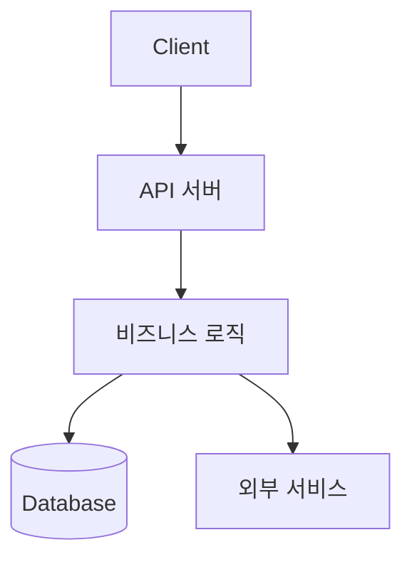
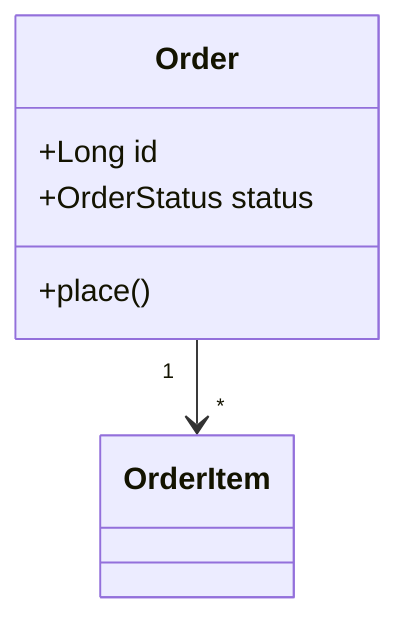
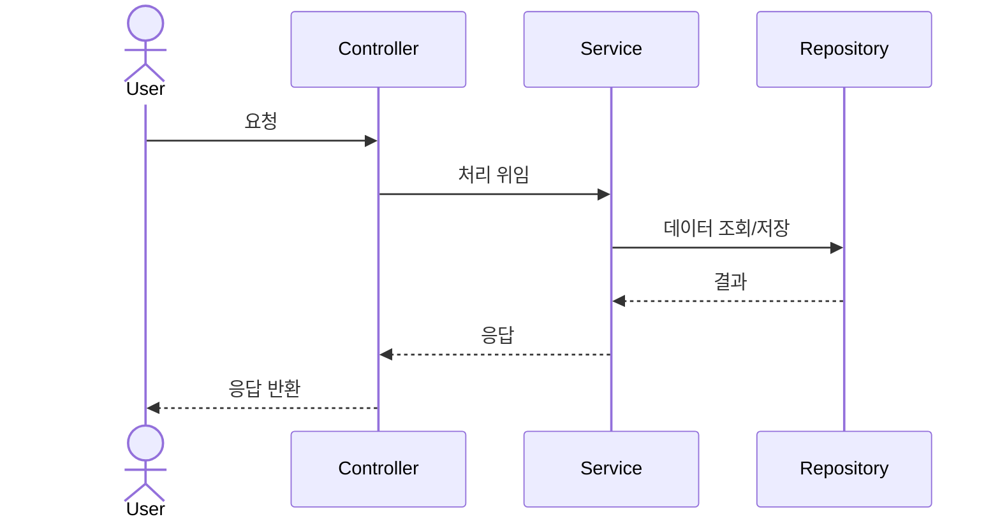
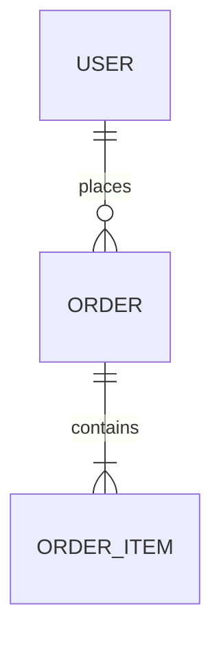

# 레거시 프로젝트 분석 프롬프트

당신은 레거시 코드베이스를 처음 인수인계 받은 시니어 개발자입니다.
이 프로젝트의 **전체 구조**와 **배포 방법**을 신규 합류자가 한눈에 이해할 수 있도록 분석 문서를 작성하세요.

분석 결과물은 `./docs/analysis/` 디렉터리 하위에 마크다운 파일로 생성하고,
다이어그램은 모두 **Mermaid** 문법으로 작성해 마크다운에서 바로 렌더링되게 합니다.

---

## 0. 작업 원칙

- 추측하지 말 것. 모든 서술은 실제 코드/설정 파일 근거를 기반으로 하고, 근거가 된 파일 경로를 명시한다.
- 코드 전체를 무작정 읽지 말 것. 아래 순서로 **진입점 → 핵심 흐름 → 주변부**로 좁혀가며 탐색한다.
- 불확실하거나 죽은 코드(dead code)로 의심되는 부분은 추정하지 말고 `⚠️ 확인 필요` 로 표시한다.
- 너무 세부적인 유틸/DTO까지 다이어그램에 넣지 말 것. **이해에 필요한 주요 컴포넌트만** 시각화한다.

---

## 1. 사전 탐색 (Reconnaissance)

먼저 프로젝트의 뼈대를 파악한다.

1. 루트 디렉터리 구조를 깊이 2~3단계까지 훑고, 모듈/패키지 단위로 역할을 추정한다.
2. 빌드/의존성 파일을 찾아 기술 스택을 식별한다.
   `package.json`, `pom.xml`, `build.gradle`, `requirements.txt`, `go.mod`, `*.csproj`, `Gemfile` 등
3. 진입점(entry point)을 찾는다. (`main`, `Application`, `index`, `app.py`, 라우터 등록부 등)
4. 설정 파일을 수집한다. (`.env*`, `application.yml`, `config/*`, `appsettings.json` 등)

> 산출물: `docs/analysis/00-overview.md`
> - 프로젝트 한 줄 요약 / 도메인
> - 기술 스택 표 (언어, 프레임워크, DB, 캐시, 메시지큐, 빌드도구, 버전)
> - 디렉터리 구조 트리와 각 디렉터리 역할 설명

---

## 2. 전체 아키텍처 다이어그램

시스템을 구성하는 주요 컴포넌트와 외부 의존성(DB, 외부 API, 큐, 캐시 등)의 관계를 그린다.

> 산출물: `docs/analysis/01-architecture.md`
> - 위와 같은 컴포넌트 다이어그램 (실제 구성요소로 채울 것)
> - 레이어 구조 설명 (예: Controller → Service → Repository)
> - 외부 의존성 목록과 연동 방식

---

## 3. 클래스 다이어그램 (도메인 모델)

핵심 도메인의 주요 클래스/엔티티와 관계(상속, 구현, 연관, 의존)를 표현한다.
전체가 아니라 **도메인별로 분리**해서 그린다. (예: 주문 도메인, 사용자 도메인)

> 산출물: `docs/analysis/02-class-diagram.md`
> - 도메인별 클래스 다이어그램
> - 주요 클래스의 책임(responsibility) 한 줄 설명
> - 핵심 enum / 상태값 정의

---

## 4. 시퀀스 다이어그램 (핵심 플로우)

이 시스템에서 **가장 중요한 사용자 시나리오 3~5개**를 골라 요청부터 응답까지의 흐름을 그린다.
(예: 로그인, 주문 생성, 결제, 배치 작업 등)

각 플로우마다 어떤 클래스/메서드를 거쳐 DB·외부 API와 어떻게 상호작용하는지 추적한다.

> 산출물: `docs/analysis/03-sequence-diagrams.md`
> - 시나리오별 시퀀스 다이어그램
> - 각 단계가 실제로 어느 파일/메서드에 해당하는지 표로 매핑

---

## 5. 데이터 흐름 / DB 스키마

- 주요 테이블(엔티티)과 관계를 ER 다이어그램으로 정리한다.
- 마이그레이션/스키마 파일이 있으면 근거로 사용한다.

> 산출물: `docs/analysis/04-data-model.md`
> - ER 다이어그램
> - 주요 테이블 설명
> - 외부 데이터 소스/연동 흐름

---

## 6. 배포 방법 (Deployment)

빌드부터 실제 배포·운영까지 **재현 가능한 절차**로 정리한다.
설정 파일과 스크립트를 근거로, 실제로 어떻게 띄우는지 단계별로 서술한다.

확인할 항목:
- **빌드**: 빌드 명령, 산출물(jar/이미지/번들 등), 빌드 환경 요구사항
- **컨테이너**: `Dockerfile`, `docker-compose.yml`, 베이스 이미지, 노출 포트
- **CI/CD**: `.github/workflows/`, `.gitlab-ci.yml`, `Jenkinsfile` 등 파이프라인 단계
- **인프라**: 배포 대상(K8s, EC2, 서버리스 등), 매니페스트/IaC 파일(`*.yaml`, `terraform/`)
- **환경 변수 / 시크릿**: 필요한 환경변수 목록과 용도 (값은 적지 말 것, 키와 설명만)
- **실행/기동**: 로컬 실행 방법, 운영 기동 방법, 헬스체크 엔드포인트
- **롤백 / 무중단 배포** 전략이 있다면 함께 정리

> 산출물: `docs/analysis/05-deployment.md`
> - 배포 파이프라인 다이어그램
> - 단계별 배포 절차 (명령어 포함)
> - 환경변수 표 (키 / 필수여부 / 설명)
> - 로컬 개발 환경 세팅 가이드

---

## 7. 종합 & 리스크

마지막으로 분석 과정에서 발견한 것들을 정리한다.

> 산출물: `docs/analysis/06-summary.md`
> - 전체 구조 요약 (3~5문장)
> - 발견된 기술 부채 / 위험 요소 / 데드 코드 의심 지점
> - 문서화·테스트가 부족한 영역
> - 신규 합류자를 위한 "여기부터 보세요" 가이드

---

## 산출물 체크리스트

- [ ] `docs/analysis/00-overview.md`
- [ ] `docs/analysis/01-architecture.md`
- [ ] `docs/analysis/02-class-diagram.md`
- [ ] `docs/analysis/03-sequence-diagrams.md`
- [ ] `docs/analysis/04-data-model.md`
- [ ] `docs/analysis/05-deployment.md`
- [ ] `docs/analysis/06-summary.md`

모든 다이어그램은 Mermaid로 작성하고, 모든 주장에는 근거 파일 경로를 명시할 것.
